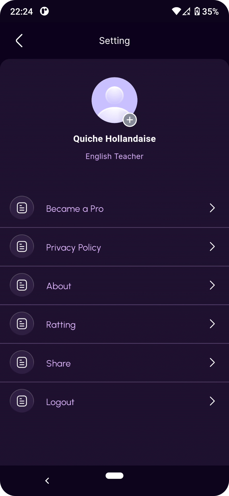

# donors

### Table of contents

- [System requirements](#system-requirements)
- [Figma design guidelines for better UI accuracy](#figma-design-guideline-for-better-accuracy)
- [Application structure](#project-structure)
- [How to format your code?](#how-you-can-do-code-formatting)
- [Libraries and tools used](#libraries-and-tools-used)
- [Api Integration Flow](#Api-Integration-Flow)

### System requirements

- Flutter 3.19.5 • channel stable • https://github.com/flutter/flutter.git
- Tools • Dart 3.3.3 • DevTools 2.31.1

### Application structure

After successful build, your application structure should look like this:

```
.
├── android                         - It contains files required to run the application on an Android platform.
├── assets                          - It contains all images and fonts of your application.
├── ios                             - It contains files required to run the application on an iOS platform.
├── lib                             - Most important folder in the application, used to write most of the Dart code..
    ├── main.dart                   - Starting point of the application
    ├── core
    │   ├── app_export.dart         - It contains commonly used file imports
    │   ├── constants               - It contains all constants classes
    │   ├── errors                  - It contains error handling classes
    │   ├── network                 - It contains network-related classes
    │   └── utils                   - It contains common files and utilities of the application
    ├── data
    │   ├── apiClient               - It contains API calling methods
    │   ├── models                  - It contains request/response models
    │   └── repository              - Network repository
    ├── localization                - It contains localization classes
    ├── presentation                - It contains widgets of the screens with their controllers and the models of the whole application.
    ├── routes                      - It contains all the routes of the application
    └── theme                       - It contains app theme and decoration classes
    └── widgets                     - It contains all custom widget classes
```

### How to format your code?

- if your code is not formatted then run following command in your terminal to format code
  ```
  dart format .
  ```

# Flutter Package Dependencies

This Flutter project utilizes several packages to enhance functionality. Below are the details of each package along with its version, description, configuration for Android and iOS platforms, and links to their documentation.

## [cupertino_icons](https://pub.dev/packages/cupertino_icons) - ^1.0.6

- **Version:** 1.0.6
- **Description:** Cupertino icons for your Flutter applications.
- **Configuration:**
  - **iOS:** No specific configuration required.
  - **Android:** No specific configuration required.

## [dio](https://pub.dev/packages/dio) - ^5.4.2+1

- **Version:** 5.4.2+1
- **Description:** A powerful HTTP client for Dart, which supports Interceptors, FormData, Request Cancellation, File Downloading, Timeout, etc.
- **Configuration:**
  - **iOS:** No specific configuration required.
  - **Android:** No specific configuration required.

## [get](https://pub.dev/packages/get) - ^4.6.6

- **Version:** 4.6.6
- **Description:** A state management package that brings dependency injection, auto-dispose features, and a lot of other goodies.
- **Configuration:**
  - **iOS:** No specific configuration required.
  - **Android:** No specific configuration required.

## [hive](https://pub.dev/packages/hive) - ^2.2.3

- **Version:** 2.2.3
- **Description:** Hive is a lightweight and blazing-fast key-value database written in pure Dart.
- **Configuration:**
  - **iOS:** No specific configuration required.
  - **Android:** No specific configuration required.

## [intl](https://pub.dev/packages/intl) - ^0.19.0

- **Version:** 0.19.0
- **Description:** This package provides internationalization and localization facilities, including message translation, plurals, and genders, date/number formatting, and parsing.
- **Configuration:**
  - **iOS:** No specific configuration required.
  - **Android:** No specific configuration required.

## [lottie](https://pub.dev/packages/lottie) - ^3.1.0

- **Version:** 3.1.0
- **Description:** Lottie is a mobile library for Android and iOS that parses Adobe After Effects animations exported as json with Bodymovin and renders them natively on mobile!
- **Configuration:**
  - **iOS:** No specific configuration required.
  - **Android:** No specific configuration required.

## [country_pickers](https://pub.dev/packages/country_pickers) - ^2.0.0

- **Version:** 2.0.0
- **Description:** A Flutter package for showing a country list with an associated call code picker.
- **Configuration:**
  - **iOS:** No specific configuration required.
  - **Android:** No specific configuration required.

## [url_launcher](https://pub.dev/packages/url_launcher) - ^6.2.5

- **Version:** 6.2.5
- **Description:** Flutter plugin for launching a URL in the mobile platform. Supports iOS and Android.
- **Configuration:**
  - **iOS:** Add the following to your Info.plist:
    ```xml
    <key>LSApplicationQueriesSchemes</key>
    <array>
      <string>tel</string>
      <string>mailto</string>
      <string>http</string>
      <string>https</string>
    </array>
    ```
  - **Android:** No specific configuration required.

## [image_picker](https://pub.dev/packages/image_picker) - ^1.0.7

- **Version:** 1.0.7
- **Description:** A Flutter plugin for iOS and Android for picking images from the image library and taking new pictures with the camera.
- **Configuration:**
  - **iOS:** Add the following to your Info.plist:
    ```xml
    <key>NSCameraUsageDescription</key>
    <string>Can we use the camera?</string>
    <key>NSPhotoLibraryUsageDescription</key>
    <string>Can we access the photo library?</string>
    ```
  - **Android:** Add the following to your AndroidManifest.xml:
    ```xml
    <uses-permission android:name="android.permission.CAMERA"/>
    <uses-permission android:name="android.permission.WRITE_EXTERNAL_STORAGE"/>
    ```

## [hive_flutter](https://pub.dev/packages/hive_flutter) - ^1.1.0

- **Version:** 1.1.0
- **Description:** Flutter integration for Hive, a lightweight and blazing-fast key-value database written in pure Dart.
- **Configuration:**
  - **iOS:** No specific configuration required.
  - **Android:** No specific configuration required.

## [flutter_svg](https://pub.dev/packages/flutter_svg) - ^2.0.10+1

- **Version:** 2.0.10+1
- **Description:** SVG parsing, rendering, and widget library for Flutter.
- **Configuration:**
  - **iOS:** No specific configuration required.
  - **Android:** No specific configuration required.

## [dotted_border](https://pub.dev/packages/dotted_border) - ^2.1.0

- **Version:** 2.1.0
- **Description:** A flutter package to easily create your custom Dotted Borders around a widget.
- **Configuration:**
  - **iOS:** No specific configuration required.
  - **Android:** No specific configuration required.

## [in_app_review](https://pub.dev/packages/in_app_review) - ^2.0.9

- **Version:** 2.0.9
- **Description:** This plugin allows Flutter apps to request and manage in-app reviews from the respective platform's app store.
- **Configuration:**
  - **iOS:** No specific configuration required.
  - **Android:** No specific configuration required.

## [speech_to_text](https://pub.dev/packages/speech_to_text) - ^6.6.1

- **Version:** 6.6.1
- **Description:** A plugin that converts speech to text.
- **Configuration:**
  - **iOS:** No specific configuration required.
  - **Android:** No specific configuration required.

## [pin_code_fields](https://pub.dev/packages/pin_code_fields) - ^8.0.1

- **Version:** 8.0.1
- **Description:** A Flutter package for entering pin code.
- **Configuration:**
  - **iOS:** No specific configuration required.
  - **Android:** No specific configuration required.

## [flutter_rating_bar](https://pub.dev/packages/flutter_rating_bar) - ^4.0.1

- **Version:** 4.0.1
- **Description:** A simple yet customizable star rating bar for Flutter which also includes a rating bar indicator for showing the rating value.
- **Configuration:**
  - **iOS:** No specific configuration required.
  - **Android:** No specific configuration required.

## [cached_network_image](https://pub.dev/packages/cached_network_image) - ^3.3.1

- **Version:** 3.3.1
- **Description:** Flutter library to load and cache network images.
- **Configuration:**
  - **iOS:** No specific configuration required.
  - **Android:** No specific configuration required.

## [flutter_staggered_animations](https://pub.dev/packages/flutter_staggered_animations) - ^1.1.1

- **Version:** 1.1.1
- **Description:** Easily add staggered animations to your ListView, GridView, Column, and Row children as shown in Material Design guidelines.
- **Configuration:**
  - **iOS:** No specific configuration required.
  - **Android:** No specific configuration required.

## [connectivity_plus](https://pub.dev/packages/connectivity_plus) - ^6.0.1

- **Version:** 6.0.1
- **Description:** Flutter plugin for discovering the state of the network (WiFi & mobile/cellular) connectivity on Android and iOS.
- **Configuration:**
  - **iOS:** Add the following to your Info.plist:
    ```xml
    <key>NSAllowsLocalNetworking</key>
    <true/>
    ```
  - **Android:** No specific configuration required.

## [outline_gradient_button](https://pub.dev/packages/outline_gradient_button) - ^2.0.1+1

- **Version:** 2.0.1+1
- **Description:** A Flutter package for creating gradient buttons with an outline.
- **Configuration:**
  - **iOS:** No specific configuration required.
  - **Android:** No specific configuration required.

## [permission_handler](https://pub.dev/packages/permission_handler) - ^11.3.1

- **Version:** 11.3.1
- **Description:** A Flutter plugin for requesting permissions on Android, iOS, and the web.
- **Configuration:**
  - **iOS:** No specific configuration required.
  - **Android:** No specific configuration required.

## [shared_preferences](https://pub.dev/packages/shared_preferences) - ^2.2.2

- **Version:** 2.2.2
- **Description:** Flutter plugin for reading and writing simple key-value pairs. Wraps NSUserDefaults on iOS and SharedPreferences on Android.
- **Configuration:**
  - **iOS:** No specific configuration required.
  - **Android:** No specific configuration required.

### Check the UI of the entire app

|  |  |  |
| :--------------------------------------------: | :--------------------------------------------: | :--------------------------------------------: |
|  |  |  |
|  |  |  |
|  |  |                                                |
